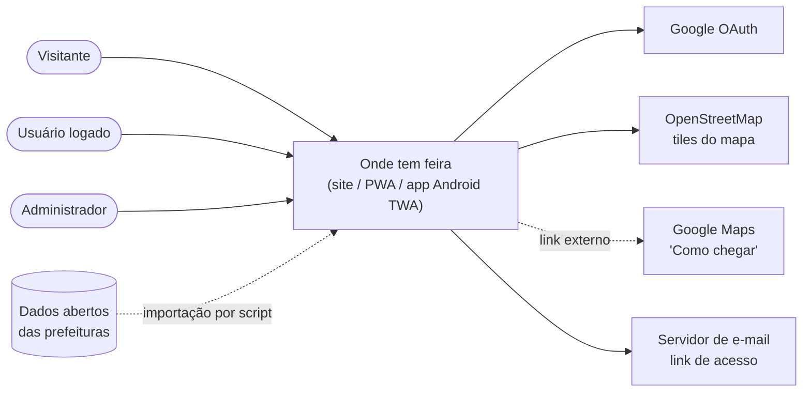
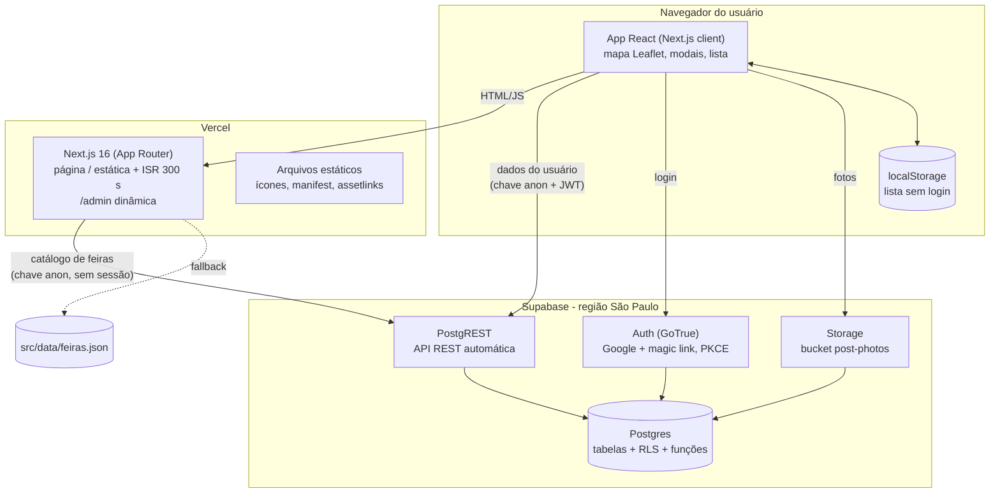
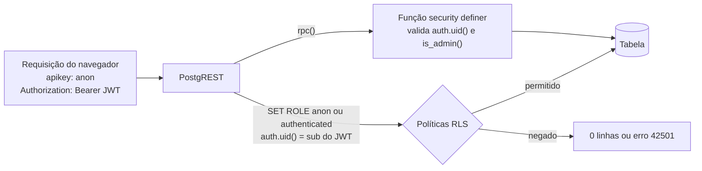
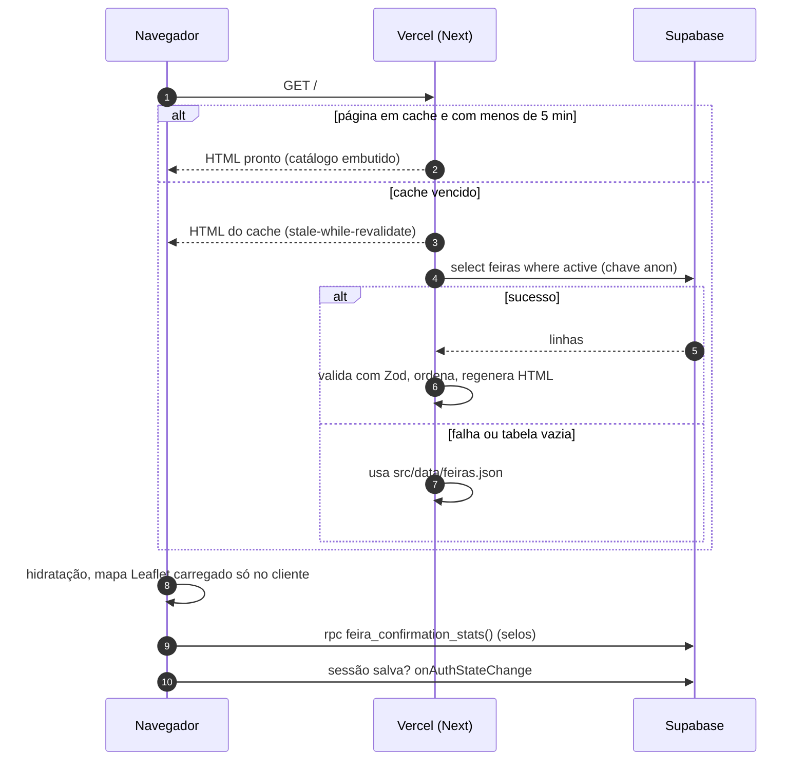
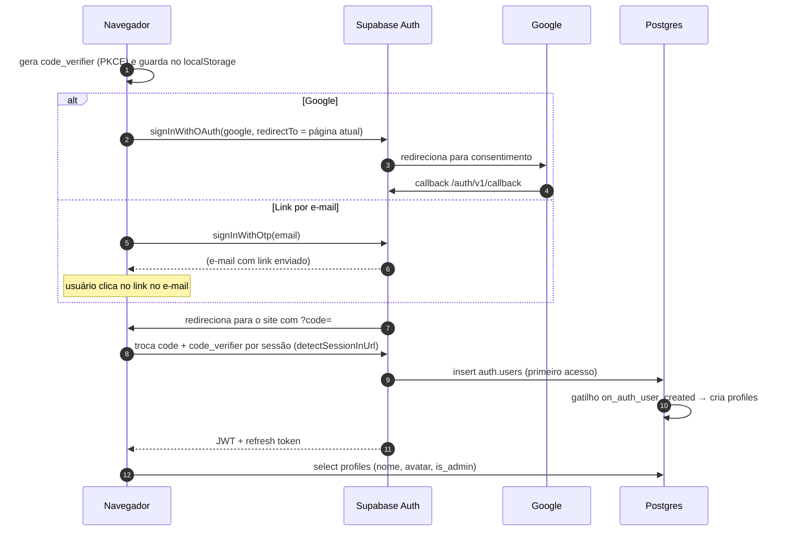
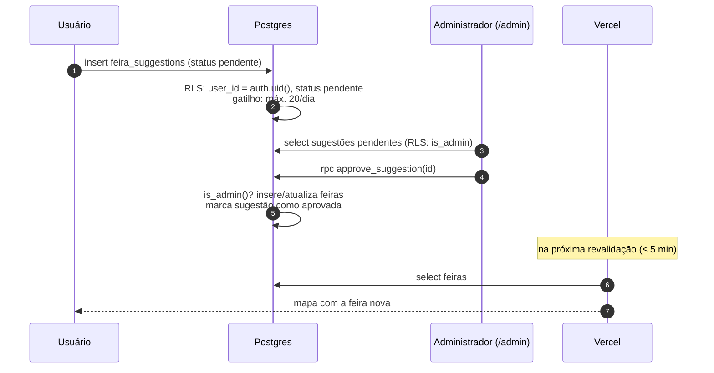
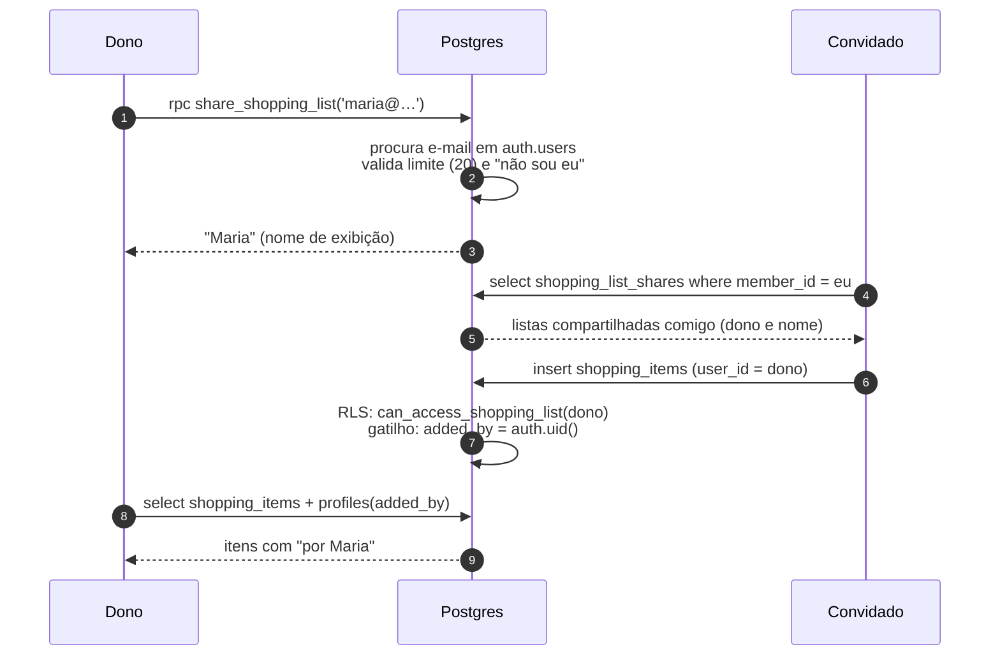
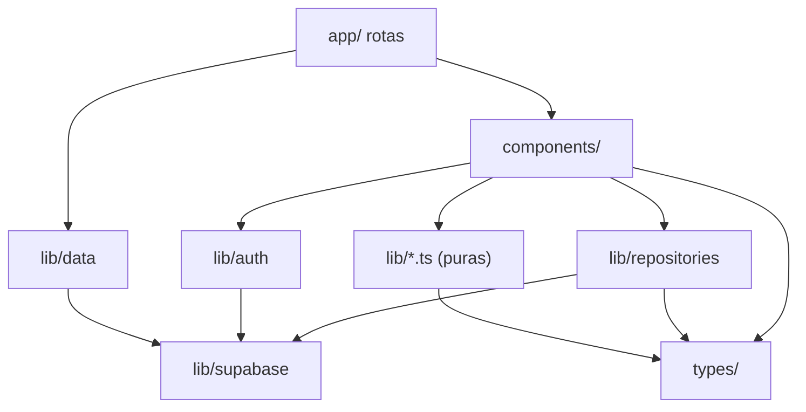

# Arquitetura

Como o sistema é montado, como as partes conversam e por quê. Para o detalhe de cada tabela
veja [BANCO-DE-DADOS.md](BANCO-DE-DADOS.md); para componentes e estado, [FRONTEND.md](FRONTEND.md).

## 1. Resumo em um parágrafo

O Onde tem feira é uma aplicação **Next.js** hospedada na **Vercel** que conversa **direto do
navegador** com o **Supabase** (Postgres, Auth e Storage) usando a chave pública. **Não existe
backend próprio**: as regras de negócio e de segurança vivem no banco, em políticas RLS,
gatilhos e funções SQL. O servidor Next só gera a página inicial (estática, revalidada a cada
5 minutos) lendo o catálogo de feiras. Sem Supabase configurado, o app funciona em modo
offline com um JSON embutido.

## 2. Contexto (C4 nível 1)



## 3. Contêineres (C4 nível 2)



| Contêiner        | Responsabilidade                                                                           | Tecnologia                             |
| ---------------- | ------------------------------------------------------------------------------------------ | -------------------------------------- |
| App no navegador | Interface, filtros, mapa, chamadas ao Supabase com o JWT do usuário                       | React 19, Leaflet, supabase-js         |
| Servidor Next    | Renderizar a página inicial com o catálogo; servir páginas institucionais e `/admin`      | Next.js 16 na Vercel                   |
| PostgREST        | Expor tabelas e funções como API REST, aplicando RLS com o papel do JWT                    | Gerenciado pelo Supabase               |
| Auth             | Login com Google e por link de e-mail; emite JWT                                           | Supabase Auth                          |
| Storage          | Fotos dos relatos, com políticas por pasta                                                 | Supabase Storage (S3)                  |
| Postgres         | Dados, regras de negócio, autorização, limites antiabuso                                   | Postgres 17 (Supabase)                 |

## 4. Modelo de segurança



Princípios:

1. **A chave anon é pública** e vai no JavaScript. Ela não dá poder nenhum sozinha; o que
   define o acesso é o papel (`anon` ou `authenticated`) e o `auth.uid()` do JWT.
2. **RLS em todas as tabelas.** Sem política, nada é permitido.
3. **Escritas sensíveis só por função.** O catálogo (`feiras`) não tem política de escrita: só
   `approve_suggestion()` altera, e ela exige `is_admin()`. Compartilhar lista só por
   `share_shopping_list()`, que procura o e-mail em `auth.users` sem expô-lo.
4. **Campos que o usuário não pode forjar** são definidos pelo banco: `user_id default
   auth.uid()` + `with check`, `added_by` por gatilho, `is_admin` protegido por gatilho,
   `confirmed_on = current_date`.
5. **Funções `security definer`** sempre com `set search_path = ''` e nomes qualificados
   (`public.tabela`), para não serem sequestradas por objetos com o mesmo nome.
6. **Nenhum segredo no app.** A chave `service_role` só é usada nos testes locais.

A matriz completa de permissões está em [BANCO-DE-DADOS.md](BANCO-DE-DADOS.md#4-matriz-de-permissões-rls).

## 5. Fluxos principais

### 5.1 Carregar a página inicial



### 5.2 Login (Google ou link por e-mail, PKCE)



### 5.3 Sugestão → moderação → mapa



### 5.4 Compartilhar a lista de compras



## 6. Organização do código

```
src/
  app/                  rotas do App Router (/, /admin, /sobre, /privacidade, /termos)
  components/           componentes React por área
    map/                Leaflet (carregado só no navegador)
    feira/              detalhes, mural, confirmação, sugestões
    shopping/           compartilhamento da lista
    admin/              painel de moderação
    ui/                 Modal, Alert, Avatar (genéricos)
  lib/
    auth/               AuthProvider: sessão, perfil, login, exclusão de conta
    data/               getFeiras (servidor) com fallback para o JSON
    repositories/       acesso ao Supabase pelos componentes (posts, feedback, shopping)
    supabase/           clientes e tipos gerados do banco
    hooks/              useToday
    *.ts                funções puras (filtros, datas, formatação)
  types/                tipos de domínio + esquemas Zod
  data/feiras.json      catálogo embutido (fallback e carga inicial)
supabase/
  migrations/           SQL versionado (fonte da verdade do banco)
  templates/            e-mails de login em português
  config.toml           configuração do Supabase local
scripts/                geração da carga de feiras, ícones, wrapper de testes
tests/                  unit/, integration/ (RLS), e2e/ (Playwright)
docs/                   esta documentação
```

### Camadas e dependências permitidas



Regras:

- **Componentes não chamam `supabase.from(...)` diretamente**; usam funções de
  `lib/repositories`. Isso centraliza nomes de colunas e o mapeamento `snake_case → camelCase`.
  As únicas exceções são `lib/auth/AuthProvider.tsx` (perfil, Storage e exclusão de conta) e
  `lib/data/getFeiras.ts` (catálogo no servidor).
- **`lib/data/getFeiras.ts` é só de servidor** (`import "server-only"`).
- **Funções puras** (`filterFeiras`, `days`, `format`) não importam React nem Supabase, para
  serem testadas sem ambiente.

## 7. Decisões de arquitetura

As decisões estão registradas como ADRs em [`docs/adr/`](adr/README.md):

| ADR                                                  | Decisão                                                        |
| ---------------------------------------------------- | -------------------------------------------------------------- |
| [0001](adr/0001-supabase-sem-backend-proprio.md)     | Supabase com RLS em vez de um backend próprio                  |
| [0002](adr/0002-modo-offline-e-fallback.md)          | Modo offline e fallback para JSON embutido                     |
| [0003](adr/0003-catalogo-moderado-por-sugestoes.md)  | Catálogo alterado só por sugestões moderadas                   |
| [0004](adr/0004-isr-na-pagina-inicial.md)            | Página inicial estática com revalidação de 5 minutos           |
| [0005](adr/0005-login-sem-senha.md)                  | Login sem senha: Google e link por e-mail, com PKCE            |
| [0006](adr/0006-leaflet-e-openstreetmap.md)          | Leaflet + OpenStreetMap em vez de Google Maps                  |
| [0007](adr/0007-compartilhamento-de-lista-por-email.md) | Compartilhamento de lista por e-mail via função do banco    |

## 8. Pontos de extensão previstos

| Necessidade futura                       | Caminho sugerido                                                                      |
| ---------------------------------------- | ------------------------------------------------------------------------------------- |
| Lista compartilhada em tempo real        | Supabase Realtime em `shopping_items` filtrando por `user_id` do dono                 |
| Lógica que precisa de segredo (ex.: enviar e-mail transacional) | Supabase Edge Function ou Route Handler do Next com variável secreta na Vercel |
| Busca por proximidade ("perto de mim")   | Extensão PostGIS + índice geográfico, ou cálculo no cliente (188 pontos é pouco)      |
| Abrir sem internet                       | Service worker com cache do HTML e do catálogo                                        |
| Muitas cidades novas                     | Script de importação por fonte, como o de São Paulo (ver [DADOS.md](DADOS.md))        |
