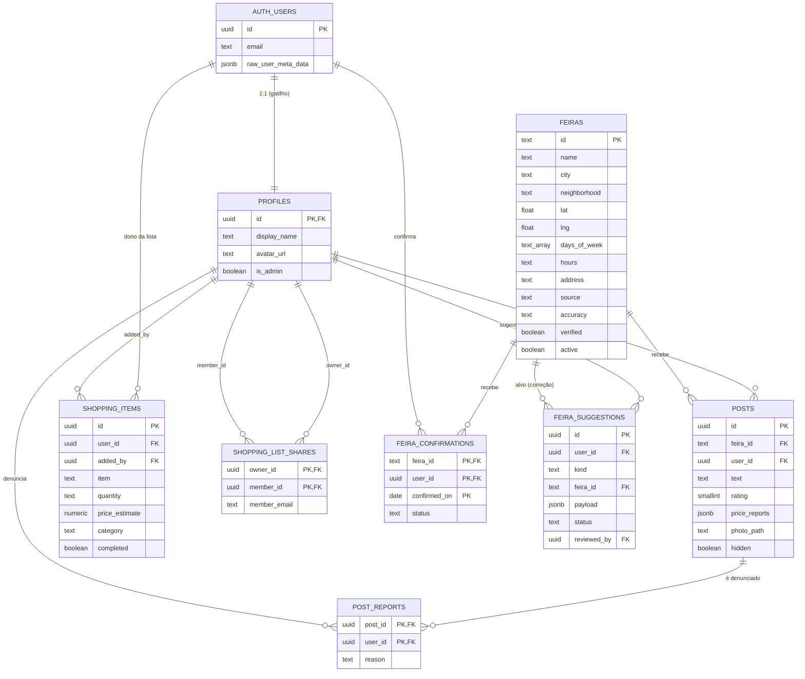

# Banco de dados

O banco é **Postgres 17 no Supabase** e é a peça central do sistema: além dos dados, guarda as
regras de autorização (RLS), as regras de negócio (funções) e os limites antiabuso
(gatilhos). A fonte da verdade são as migrations em
[`supabase/migrations/`](../supabase/migrations/):

| Migration                                   | Conteúdo                                                        |
| ------------------------------------------- | --------------------------------------------------------------- |
| `20261004120000_schema_inicial.sql`         | Todas as tabelas, RLS, funções, gatilhos e bucket de fotos      |
| `20261004120100_carga_feiras.sql`           | Carga das 188 feiras (gerada por script; não edite à mão)       |
| `20261005120000_compartilhar_lista.sql`     | Compartilhamento da lista de compras                            |
| `20261006120000_fotos_select_proprio.sql`   | Permite ao usuário listar a própria pasta de fotos (corrige a exclusão de fotos) |

Os tipos TypeScript em `src/lib/supabase/database.types.ts` são **gerados** a partir do banco
local (`npm run db:types`).

## 1. Diagrama entidade-relacionamento



Todas as chaves para usuário usam `on delete cascade`: apagar o usuário em `auth.users` apaga
todos os dados dele (base da exclusão de conta). Exceções: `shopping_items.added_by` vira
`null` (o item continua na lista do dono) e `feira_suggestions.reviewed_by` é limpo antes pela
função `delete_my_account()`.

## 2. Dicionário de dados

Todas as tabelas têm `created_at timestamptz default now()`, omitido abaixo.

### `profiles` — perfil público

| Coluna         | Tipo      | Regras                                       | Observação                                         |
| -------------- | --------- | -------------------------------------------- | -------------------------------------------------- |
| `id`           | uuid PK   | FK `auth.users`, cascade                     | Mesmo id do usuário                                |
| `display_name` | text      | 1 a 60 caracteres                            | Nome do Google, ou parte do e-mail antes do @      |
| `avatar_url`   | text      | `null` ou começa com `https://`              | Foto do Google                                     |
| `is_admin`     | boolean   | default `false`                              | Só muda pelo SQL Editor (gatilho bloqueia a API)   |

> **Nunca** guarde e-mail nesta tabela: ela é legível por todos.

### `feiras` — catálogo

| Coluna         | Tipo        | Regras                                                                 |
| -------------- | ----------- | ---------------------------------------------------------------------- |
| `id`           | text PK     | `^[a-z0-9-]{3,80}$` (ex.: `sp-pinheiros-ter-13`)                       |
| `name`         | text        | 2 a 120                                                                |
| `city`         | text        | 2 a 60                                                                 |
| `neighborhood` | text        | 1 a 80                                                                 |
| `lat`, `lng`   | double      | Dentro do Brasil: lat −34 a 6, lng −74 a −34                           |
| `days_of_week` | text[]      | 1 a 7 de `domingo, segunda, terca, quarta, quinta, sexta, sabado`      |
| `hours`        | text        | `null` (não informado pela fonte) ou até 40                            |
| `address`      | text        | `null` ou até 200                                                      |
| `source`       | text        | 2 a 400 — **sempre** de onde veio o dado                               |
| `accuracy`     | text        | `official_coords` ou `approximate`                                     |
| `verified`     | boolean     | Conferido em fonte oficial                                             |
| `active`       | boolean     | `false` = encerrada (some do mapa, não é apagada)                      |
| `updated_at`   | timestamptz | Atualizado por gatilho                                                 |

Índice: `feiras_city_idx (city) where active`.

### `posts` — relatos do mural

| Coluna          | Tipo     | Regras                                                                       |
| --------------- | -------- | ---------------------------------------------------------------------------- |
| `id`            | uuid PK  | `gen_random_uuid()`                                                          |
| `feira_id`      | text FK  | cascade                                                                      |
| `user_id`       | uuid FK  | default `auth.uid()`                                                         |
| `text`          | text     | 1 a 1000 (sem contar espaços nas pontas)                                     |
| `rating`        | smallint | `null` ou 1 a 5                                                              |
| `price_reports` | jsonb    | Array de até 10 `{product: 1–60, price: 1–30}` — validado por `valid_price_reports()` |
| `photo_path`    | text     | `null` ou `<uuid>/<arquivo>` no bucket `post-photos`                         |
| `hidden`        | boolean  | Ocultado pela moderação                                                      |

Índice: `posts_feira_created_idx (feira_id, created_at desc) where not hidden`.

### `post_reports` — denúncias

PK (`post_id`, `user_id`): uma denúncia por pessoa por relato. `reason` 1 a 300.

### `shopping_items` — lista de compras

| Coluna           | Tipo          | Regras                                                         |
| ---------------- | ------------- | -------------------------------------------------------------- |
| `id`             | uuid PK       |                                                                |
| `user_id`        | uuid FK       | **Dono da lista** (não necessariamente quem adicionou)         |
| `added_by`       | uuid FK       | Quem adicionou; definido por gatilho; `set null` ao excluir    |
| `item`           | text          | 1 a 80                                                         |
| `quantity`       | text          | 1 a 30, default `1 un`                                         |
| `price_estimate` | numeric(10,2) | `null` ou 0 a 100000                                           |
| `category`       | text          | `frutas, legumes, pasteis, peixes, temperos, outros`           |
| `completed`      | boolean       | Comprado                                                       |

Índice: `shopping_items_user_idx (user_id, created_at desc)`.

### `shopping_list_shares` — compartilhamento da lista

| Coluna         | Tipo    | Regras                                           |
| -------------- | ------- | ------------------------------------------------ |
| `owner_id`     | uuid PK | Dono da lista                                    |
| `member_id`    | uuid PK | Convidado; `check (owner_id <> member_id)`       |
| `member_email` | text    | E-mail digitado pelo dono (3 a 254), em minúsculas |

Índice: `shopping_list_shares_member_idx (member_id)`.

### `feira_confirmations` — "estive lá"

PK (`feira_id`, `user_id`, `confirmed_on`). `status` em `funcionando` ou `nao_encontrada`.
`confirmed_on` default `current_date` e a RLS só aceita a data de hoje.

### `feira_suggestions` — sugestões moderadas

| Coluna        | Tipo    | Regras                                                                 |
| ------------- | ------- | ---------------------------------------------------------------------- |
| `kind`        | text    | `nova` (sem `feira_id`) ou `alteracao` (com `feira_id`)                |
| `payload`     | jsonb   | Objeto com menos de 4000 bytes; chaves em camelCase (`daysOfWeek`…)    |
| `comment`     | text    | Até 500                                                                |
| `status`      | text    | `pendente` → `aprovada` ou `rejeitada`                                 |
| `review_note` | text    | Até 500                                                                |
| `reviewed_by` | uuid FK | Administrador que revisou                                              |
| `reviewed_at` | timestamptz |                                                                    |

Índice: `feira_suggestions_status_idx (status, created_at)`.

## 3. Funções

| Função                                   | Tipo                         | Quem pode chamar   | O que faz                                                                                                  |
| ---------------------------------------- | ---------------------------- | ------------------ | ---------------------------------------------------------------------------------------------------------- |
| `is_admin()`                             | `security definer`, stable   | todos              | `true` se o usuário logado é administrador                                                                 |
| `feira_confirmation_stats()`             | `security definer`, stable   | todos              | Por feira, nos últimos 30 dias: confirmações, "não encontrei" e última data positiva. **Anônimo.**         |
| `approve_suggestion(id, note)`           | `security definer`           | `authenticated` + exige admin | Aplica a sugestão no catálogo (insere ou atualiza `feiras`) e marca como aprovada. Retorna o id da feira. |
| `reject_suggestion(id, note)`            | `security definer`           | `authenticated` + exige admin | Marca como rejeitada                                                                            |
| `delete_my_account()`                    | `security definer`           | `authenticated`    | Apaga o próprio usuário (cascata em tudo)                                                                  |
| `share_shopping_list(target_email)`      | `security definer`           | `authenticated`    | Compartilha a lista do chamador com o dono do e-mail; retorna o nome de exibição. Erros `P0001` em português. |
| `can_access_shopping_list(list_owner)`   | `security definer`, stable   | (usada pela RLS)   | `true` se o chamador é o dono ou convidado                                                                 |
| `slugify(text)`                          | immutable                    | —                  | Gera ids de feira sem acento                                                                               |
| `valid_price_reports(jsonb)`             | immutable                    | —                  | Valida o JSON de preços (usada em `check`)                                                                 |

### Gatilhos

| Gatilho                          | Tabela           | Quando                 | Efeito                                                                 |
| -------------------------------- | ---------------- | ---------------------- | ---------------------------------------------------------------------- |
| `on_auth_user_created`           | `auth.users`     | after insert           | Cria `profiles` (`handle_new_user`)                                    |
| `profiles_protect_admin`         | `profiles`       | before update          | Erro se `anon`/`authenticated` tentar mudar `is_admin`                 |
| `feiras_touch`                   | `feiras`         | before update          | `updated_at = now()`                                                   |
| `posts_rate_limit`               | `posts`          | before insert          | Erro `P0001` a partir de 10 relatos na última hora                     |
| `suggestions_rate_limit`         | `feira_suggestions` | before insert       | Erro `P0001` a partir de 20 sugestões no último dia                    |
| `shopping_items_set_added_by`    | `shopping_items` | before insert/update   | Insert: `added_by = auth.uid()`. Update: mantém o valor antigo         |

### Convenção de erros

Erros pensados para o usuário final usam `errcode = 'P0001'` e mensagem em português. O
`friendlyError()` (`src/lib/format.ts`) repassa essas mensagens para a tela e traduz os demais
erros técnicos. Erros de permissão usam `42501`.

## 4. Matriz de permissões (RLS)

Legenda: ✅ permitido · ❌ negado · 🔸 condicional.

| Tabela                 | Operação | Visitante (`anon`) | Usuário (`authenticated`)                                      | Administrador                     |
| ---------------------- | -------- | ------------------ | -------------------------------------------------------------- | --------------------------------- |
| `profiles`             | select   | ✅                 | ✅                                                             | ✅                                |
|                        | update   | ❌                 | 🔸 só o próprio, sem mudar `is_admin`                          | 🔸 idem (promoção só via SQL)     |
| `feiras`               | select   | 🔸 ativas          | 🔸 ativas                                                      | ✅ todas                          |
|                        | escrita  | ❌                 | ❌ (só via `approve_suggestion`)                               | ❌ direto; ✅ via função          |
| `posts`                | select   | 🔸 não ocultos     | 🔸 não ocultos + os próprios                                   | ✅                                |
|                        | insert   | ❌                 | 🔸 em seu nome, `hidden = false`                               | 🔸 idem                           |
|                        | update   | ❌                 | ❌                                                             | ✅ (ocultar/reexibir)             |
|                        | delete   | ❌                 | 🔸 os próprios                                                 | ✅                                |
| `post_reports`         | insert   | ❌                 | 🔸 em seu nome                                                 | 🔸 idem                           |
|                        | select   | ❌                 | 🔸 as próprias                                                 | ✅                                |
|                        | delete   | ❌                 | ❌                                                             | ✅                                |
| `shopping_items`       | todas    | ❌                 | 🔸 se `can_access_shopping_list(user_id)` (dono ou convidado) | 🔸 idem (sem privilégio extra)    |
| `shopping_list_shares` | select   | ❌                 | 🔸 se é dono ou convidado                                      | 🔸 idem                           |
|                        | insert   | ❌                 | ❌ (só via `share_shopping_list`)                              | ❌ idem                           |
|                        | delete   | ❌                 | 🔸 se é dono ou convidado                                      | 🔸 idem                           |
| `feira_confirmations`  | select   | ❌ (use a função)  | 🔸 as próprias                                                 | 🔸 as próprias                    |
|                        | insert/update | ❌            | 🔸 em seu nome, só com a data de hoje                          | 🔸 idem                           |
| `feira_suggestions`    | insert   | ❌                 | 🔸 em seu nome, `pendente`, sem campos de revisão              | 🔸 idem                           |
|                        | select   | ❌                 | 🔸 as próprias                                                 | ✅                                |
|                        | update   | ❌                 | ❌                                                             | ❌ direto; ✅ via funções         |
| `storage.objects` (`post-photos`) | select (listar) | ❌ (fotos abertas só pela URL pública) | 🔸 só a própria pasta              | 🔸 idem                           |
|                        | insert   | ❌                 | 🔸 só na pasta `<seu-uuid>/`, JPG/PNG/WebP até 5 MB            | 🔸 idem                           |
|                        | delete   | ❌                 | 🔸 só na própria pasta                                         | 🔸 idem                           |

Estas regras são verificadas em [`tests/integration/rls.test.ts`](../tests/integration/rls.test.ts),
que testa principalmente o que **não** pode ser feito. Mudou uma linha da matriz? Ajuste ou
crie o teste correspondente.

## 5. Storage

- Bucket **`post-photos`**, público para leitura **pela URL** (as fotos aparecem no mural sem
  login). Listar arquivos pela API só é permitido na própria pasta.
- **Atenção:** no Supabase Storage, `list()` e `remove()` só enxergam arquivos que a política
  de **select** permite. Sem ela, apagar "funciona" sem erro mas não apaga nada (foi o que
  aconteceu até a migration `20261006120000`).
- Limites no próprio bucket: 5 MB e tipos `image/jpeg`, `image/png`, `image/webp`.
- Caminho: `<id-do-usuário>/<uuid-aleatório>.<jpg|png|webp>`. A política exige que a primeira pasta seja o
  `auth.uid()` de quem envia.
- Ao apagar um relato, o app apaga a foto. Ao excluir a conta, o app apaga a pasta inteira
  **antes** de chamar `delete_my_account()` (o banco não alcança o Storage).

## 6. Como mudar o banco

1. `npx supabase migration new descricao_curta` cria um arquivo em `supabase/migrations/`.
2. Escreva o SQL. Checklist:
   - [ ] `alter table … enable row level security` em toda tabela nova
   - [ ] Políticas com `to authenticated` e `(select auth.uid())` (o `select` evita reavaliar
         por linha)
   - [ ] `check` para tamanhos e valores permitidos
   - [ ] Funções `security definer` com `set search_path = ''` e nomes qualificados
   - [ ] `revoke execute … from public, anon` em funções que exigem login
   - [ ] Mensagens para o usuário com `errcode = 'P0001'`, em português
3. `npm run db:reset` recria o banco local do zero com todas as migrations.
4. `npm run db:types` atualiza os tipos TypeScript.
5. Testes em `tests/integration/rls.test.ts` cobrindo **o que pode e o que não pode**.
   `npm run test:db`.
6. Atualize esta página (dicionário, funções e matriz).
7. Produção: veja [OPERACAO.md](OPERACAO.md#4-migrations-em-produção). **Nunca edite uma
   migration já aplicada**; crie outra.

## 7. Consultas úteis (SQL Editor)

```sql
-- Quantas feiras por cidade e quantas verificadas
select city, count(*) total, count(*) filter (where verified) verificadas
from public.feiras where active group by city order by total desc;

-- Sugestões pendentes mais antigas
select id, kind, payload ->> 'name' nome, created_at
from public.feira_suggestions where status = 'pendente' order by created_at;

-- Feiras com mais "não encontrei" nos últimos 30 dias
select f.name, f.city, s.*
from public.feira_confirmation_stats() s join public.feiras f on f.id = s.feira_id
where s.not_found_30d > 0 order by s.not_found_30d desc;

-- Tornar alguém administrador
update public.profiles set is_admin = true
where id = (select id from auth.users where email = 'pessoa@exemplo.com');
```
