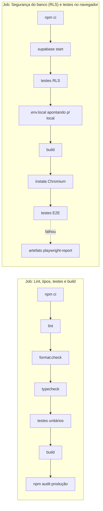

# Ferramentas e serviços

Inventário de tudo o que o projeto usa: para que serve, versão e onde está configurado.
Versões conforme o `package-lock.json` da versão 1.1.0. O Dependabot propõe atualizações
semanalmente.

## 1. Aplicação (vai para produção)

| Pacote                  | Versão  | Para que serve                                                  | Onde configura / usa                          |
| ----------------------- | ------- | --------------------------------------------------------------- | --------------------------------------------- |
| **Next.js**             | 16.3.8  | Framework React: rotas, renderização no servidor, ISR, build    | `next.config.ts`, `src/app/`                  |
| **React** / React DOM   | 19.3.0  | Interface                                                       | `src/components/`                             |
| **TypeScript**          | 5.9.3   | Tipagem estrita                                                 | `tsconfig.json` (`strict`, alvo ES2022, alias `@/*`) |
| **@supabase/supabase-js** | 2.117.2 | Cliente do Supabase: Auth, consultas REST, RPC, Storage       | `src/lib/supabase/client.ts`                  |
| **Leaflet**             | 1.9.4   | Mapa interativo                                                 | `src/components/map/`                         |
| **react-leaflet**       | 5.0.0   | Componentes React para o Leaflet                                | `src/components/map/`                         |
| **Zod**                 | 4.6.5   | Validação de formulários e dos dados do catálogo                | `src/types/`                                  |
| **Tailwind CSS**        | 4.3.3   | Estilos utilitários                                             | `src/app/globals.css`, `postcss.config.mjs`   |
| **server-only**         | 0.0.1   | Impede importar código de servidor no navegador                 | `src/lib/data/getFeiras.ts`                   |
| **Geist** (Google Fonts via `next/font`) | — | Fonte; baixada no build e servida pelo próprio site | `src/app/layout.tsx`                     |

## 2. Desenvolvimento e qualidade

| Ferramenta                      | Versão  | Para que serve                                         | Configuração                         |
| ------------------------------- | ------- | ------------------------------------------------------ | ------------------------------------ |
| **ESLint** + eslint-config-next | 9.39 / 16.3.8 | Regras de React, hooks, Next e TypeScript         | `eslint.config.mjs` (flat config)    |
| **Prettier**                    | 3.9.9   | Formatação automática                                  | `.prettierrc.json` (`printWidth: 100`) |
| **Vitest**                      | 5.0.3   | Testes unitários, de componentes e de banco            | `vitest.config.mts`                  |
| **Testing Library** (React, user-event, jest-dom) | 16.3 | Testar componentes como o usuário usa     | `tests/setup.ts`                     |
| **jsdom**                       | 29.1.1  | DOM simulado para os testes de componentes             | `vitest.config.mts`                  |
| **Playwright**                  | 1.63.0  | Testes ponta a ponta em Chromium (desktop e celular)   | `playwright.config.ts`               |
| **Supabase CLI**                | 2.119.0 | Banco local em Docker, migrations, geração de tipos, `db push` | `supabase/config.toml`       |
| **sharp**                       | 0.35.5  | Gerar os ícones PNG a partir do SVG                    | `scripts/generate-icons.mjs`         |
| **Docker**                      | —       | Necessário para o Supabase local                       | Instalação no computador             |
| **Node.js**                     | ≥ 20.9 (CI usa 22) | Execução de tudo                            | `package.json` → `engines`           |

## 3. Scripts do projeto

| Script                                  | O que faz                                                                                   |
| --------------------------------------- | ------------------------------------------------------------------------------------------- |
| `scripts/generate-feiras-migration.mjs` | Lê `src/data/feiras.json` e gera `supabase/migrations/20261004120100_carga_feiras.sql` (upsert) |
| `scripts/generate-icons.mjs`            | Gera `public/icons/*.png` (192, 512, maskable, Apple) a partir de `public/icon.svg`         |
| `scripts/with-local-supabase.mjs`       | Lê `supabase status` e roda um comando com as variáveis do banco local (usado por `test:db` e `test:e2e`) |

## 4. Serviços externos

| Serviço                  | Uso                                                                  | Plano            | Quem acessa                         | Onde fica a configuração                                  |
| ------------------------ | -------------------------------------------------------------------- | ---------------- | ----------------------------------- | --------------------------------------------------------- |
| **GitHub**               | Código, Pull Requests, Issues, CI (Actions), Dependabot, relato privado de vulnerabilidades | Gratuito | Mantenedor                     | `.github/`                                                |
| **Vercel**               | Hospedagem do Next.js, deploy automático a cada push em `main`, previews de PR | Hobby (gratuito) | Mantenedor              | Painel da Vercel → Settings → Environment Variables       |
| **Supabase**             | Postgres, Auth, Storage, API REST (região São Paulo)                  | Free             | Mantenedor                          | Painel do Supabase; esquema em `supabase/migrations/`     |
| **Google Cloud Console** | Cliente OAuth do "Entrar com Google" e tela de consentimento          | Gratuito         | Mantenedor                          | APIs e serviços → Credenciais / Tela de consentimento     |
| **OpenStreetMap**        | Imagens (tiles) do mapa                                              | Gratuito, com [política de uso](https://operations.osmfoundation.org/policies/tiles/) | Navegador do usuário | `OSM_TILES` em `leafletIcons.ts` |
| **Google Maps**          | Só um link "Como chegar" (sem API, sem chave)                       | —                | Navegador do usuário                | `FeiraCard.tsx`, `FeiraDetailsModal.tsx`                  |
| **Servidor de e-mail**   | Envio do link de login. Hoje: o padrão do Supabase (limitado). Planejado: Resend com domínio próprio | — | Supabase Auth | Supabase → Authentication → Emails → SMTP Settings |
| **Google Play Console**  | Publicação do app Android (TWA) — planejado                          | Taxa única       | Mantenedor                          | [PLAY-STORE.md](PLAY-STORE.md)                            |

### Variáveis de ambiente

| Variável                        | Obrigatória | Pública? | Onde definir                       | Efeito se ausente                              |
| ------------------------------- | ----------- | -------- | ---------------------------------- | ---------------------------------------------- |
| `NEXT_PUBLIC_SUPABASE_URL`      | Não         | Sim      | `.env.local` / Vercel              | Modo offline (sem login, mural, sugestões)     |
| `NEXT_PUBLIC_SUPABASE_ANON_KEY` | Não         | Sim      | `.env.local` / Vercel              | Modo offline                                   |
| `NEXT_PUBLIC_SITE_URL`          | Recomendada | Sim      | `.env.local` / Vercel              | Metadados usam `http://localhost:3000`         |
| `NEXT_PUBLIC_CONTACT_EMAIL`     | Recomendada | Sim      | Vercel                             | Privacidade aponta para o contato da Google Play |

Todas são `NEXT_PUBLIC_*` porque o app **não tem segredos**: a chave anon é pública por
design. Nos testes locais, `scripts/with-local-supabase.mjs` define também
`SUPABASE_TEST_SERVICE_KEY` (chave de serviço do banco **local**, nunca de produção).

## 5. Integração contínua (GitHub Actions)

Arquivo: [`.github/workflows/ci.yml`](../.github/workflows/ci.yml). Roda em todo Pull Request e
em todo push para `main`; execuções antigas do mesmo branch são canceladas.

Os dois jobs rodam em paralelo. O merge só deve acontecer com os dois verdes.

### Dependabot

[`.github/dependabot.yml`](../.github/dependabot.yml): pacotes npm **semanalmente**, agrupados
em um único PR ("dependencias"); GitHub Actions **mensalmente**. Revise o CI do PR antes do
merge; atualizações *major* de Next, React, Supabase ou Leaflet merecem um teste manual.

## 6. Ferramentas recomendadas para quem desenvolve

- **VS Code** com as extensões ESLint, Prettier, Tailwind CSS IntelliSense e PostgreSQL (ou o
  SQL Editor do Supabase Studio local em `http://127.0.0.1:54323`).
- **Mailpit** (sobe junto com o Supabase local) em `http://127.0.0.1:54324` para ver os
  e-mails de login durante o desenvolvimento.
- **Playwright UI**: `npx playwright test --ui` para depurar testes E2E.
