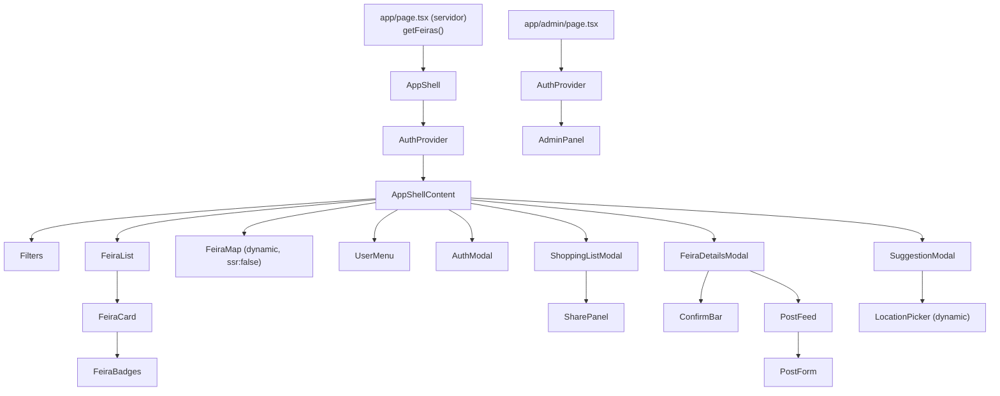

# Frontend

A aplicação é um **Next.js 16 (App Router)** com React 19, TypeScript estrito e Tailwind CSS 4.
Quase toda a interface é client-side (`"use client"`), porque depende de sessão, mapa e
interação; o servidor só monta o HTML inicial com o catálogo.

## 1. Rotas

| Rota            | Arquivo                         | Renderização                         | Conteúdo                                         |
| --------------- | ------------------------------- | ------------------------------------ | ------------------------------------------------ |
| `/`             | `src/app/page.tsx`              | Estática + ISR (`revalidate = 300`)  | `AppShell` com o catálogo de feiras              |
| `/admin`        | `src/app/admin/page.tsx`        | Dinâmica (`force-dynamic`), `noindex` | Painel de moderação (checa `is_admin` no cliente; o banco garante) |
| `/sobre`        | `src/app/sobre/page.tsx`        | Estática                             | Fontes e significado dos selos                   |
| `/privacidade`  | `src/app/privacidade/page.tsx`  | Estática                             | Política de privacidade (LGPD)                   |
| `/termos`       | `src/app/termos/page.tsx`       | Estática                             | Termos de uso                                    |

`src/app/layout.tsx` define idioma `pt-BR`, fonte Geist, metadados (Open Graph, manifesto,
ícones Apple) e `themeColor`.

## 2. Árvore de componentes



| Componente            | Responsabilidade                                                                                     |
| --------------------- | ---------------------------------------------------------------------------------------------------- |
| `AppShell`            | Estado da tela: filtros, feira selecionada, modais abertos, estatísticas de confirmação             |
| `Filters`             | Cidade, dia, "Hoje", busca, contador e "Limpar filtros"                                              |
| `FeiraList` / `FeiraCard` | Lista acessível por teclado; selos; "Como chegar"                                               |
| `FeiraMap`            | Marcadores, destaque da selecionada, centraliza na cidade                                           |
| `FeiraDetailsModal`   | Dados completos da feira, `ConfirmBar`, `PostFeed`, botão "Sugerir correção"                         |
| `PostFeed` / `PostForm` | Mural: listar, publicar (com foto), apagar, denunciar                                              |
| `SuggestionModal`     | Nova feira (com `LocationPicker` e geolocalização) ou correção                                       |
| `ShoppingListModal`   | Lista local ou na conta, abas "Minha lista" / "Lista de X", importação, total                        |
| `SharePanel`          | Compartilhar por e-mail e remover pessoas                                                           |
| `UserMenu`            | Entrar, nome do usuário, painel de moderação, sair, excluir conta                                    |
| `AuthModal`           | Botão Google e formulário de link por e-mail                                                         |
| `AdminPanel`          | Sugestões pendentes e relatos denunciados                                                            |
| `ui/Modal`            | `<dialog>` acessível: Esc, foco preso, título anunciado, rolagem do fundo bloqueada                 |
| `ui/Alert`            | Mensagem com `role="alert"` (erro) ou `role="status"` (info/sucesso)                                 |
| `ui/Avatar`           | Foto do Google ou inicial do nome (sem serviços externos)                                            |

## 3. Estado e dados

Não há biblioteca de estado global. O estado vive onde é usado:

| Estado                                  | Onde                       | Como                                                      |
| --------------------------------------- | -------------------------- | --------------------------------------------------------- |
| Sessão, usuário, perfil, cliente Supabase | `AuthProvider` (Context) | `onAuthStateChange`; perfil carregado após cada login     |
| Catálogo de feiras                      | Prop vinda do servidor     | Imutável na sessão; atualiza no próximo carregamento      |
| Filtros, seleção, modais                | `AppShell` (`useState`)    | Derivados com `useMemo` (`filterFeiras`)                  |
| Dia de hoje                             | `useToday()`               | `useSyncExternalStore`; `null` no servidor; reavalia a cada minuto e ao voltar ao app |
| Lista de compras                        | `ShoppingListModal`        | `ShoppingStore` local ou remoto; atualização otimista     |
| Estatísticas de confirmação             | `AppShell`                 | Uma chamada `rpc` ao abrir; recarregada após confirmar    |

### Padrão para buscar dados em efeitos

O ESLint do React 19 proíbe `setState` síncrono dentro de `useEffect`. O padrão do projeto é:

```tsx
const [reloadKey, setReloadKey] = useState(0);

useEffect(() => {
  if (!supabase) return;
  let cancelled = false;
  fetchAlgo(supabase)
    .then((data) => !cancelled && setData(data))
    .catch((e) => !cancelled && setError(friendlyError(e)));
  return () => {
    cancelled = true;
  };
}, [supabase, reloadKey]);

// para recarregar: setReloadKey((k) => k + 1)
```

### Atualização otimista

Na lista de compras, a tela muda na hora e volta atrás se o banco recusar:

```tsx
const mutate = async (optimistic: ShoppingItem[], action: () => Promise<unknown>) => {
  const previous = items;
  setItems(optimistic);
  try {
    await action();
  } catch (e) {
    setItems(previous);
    setError(friendlyError(e));
  }
};
```

## 4. Camada de repositórios

`src/lib/repositories/` concentra as consultas ao Supabase feitas pela interface (fora dele,
só `AuthProvider` e `getFeiras`). Os componentes recebem objetos de domínio em camelCase.

| Arquivo        | Funções                                                                                                   |
| -------------- | --------------------------------------------------------------------------------------------------------- |
| `posts.ts`     | `listPosts`, `createPost` (sobe a foto e desfaz se o insert falhar), `deletePost`, `reportPost`, `validatePhoto` |
| `feedback.ts`  | Confirmações (`fetchConfirmationStats`, `fetchMyConfirmations`, `confirmFeira`), sugestões (`suggestNewFeira`, `suggestFeiraChange`), moderação (`listPendingSuggestions`, `approveSuggestion`, `rejectSuggestion`, `listReportedPosts`, `moderatePost`) |
| `shopping.ts`  | Interface `ShoppingStore` com duas implementações: `createLocalShoppingStore(localStorage)` e `createRemoteShoppingStore(supabase, donoDaLista)`; compartilhamento (`fetchShareInfo`, `shareList`, `removeShare`); `pendingTotal` |

A interface `ShoppingStore` é o exemplo do padrão: a tela não sabe se a lista está no aparelho
ou no banco.

```ts
export interface ShoppingStore {
  list(): Promise<ShoppingItem[]>;
  add(item: NewShoppingItem): Promise<ShoppingItem>;
  setCompleted(id: string, completed: boolean): Promise<void>;
  remove(id: string): Promise<void>;
  removeCompleted(): Promise<void>;
}
```

## 5. Validação

Os esquemas **Zod** em `src/types/` são usados em três lugares: nos formulários (mensagem de
erro na tela), na leitura do catálogo (`feiraSchema` descarta registro inválido sem derrubar a
página) e nos testes. Os limites espelham os `check` do banco: se mudar um, mude o outro.

## 6. Erros

`friendlyError(error)` (`src/lib/format.ts`) converte qualquer erro em uma frase em português:

- Erros do banco com código `P0001` (limites, compartilhamento) são mostrados como vieram.
- Falha de rede, JWT expirado, violação de permissão etc. viram mensagens simples.
- Nunca mostre `error.message` cru ao usuário fora do painel de moderação.

## 7. Mapa

- **Leaflet 1.9 + react-leaflet 5**, tiles do OpenStreetMap (`OSM_TILES` em
  `components/map/leafletIcons.ts`).
- Carregado com `next/dynamic` e `ssr: false`, porque o Leaflet acessa `window`.
- Ícones dos marcadores servidos de `public/leaflet/` (não de CDN).
- Centros e zoom por cidade em `src/lib/cityCenters.ts`. **Toda cidade nova precisa de um
  centro** (há teste para isso).

## 8. Estilo e UI

- **Tailwind CSS 4** (configuração via `@import "tailwindcss"` em `globals.css`, sem
  `tailwind.config`).
- Paleta: âmbar/laranja (marca), `stone` (neutros), `emerald` (sucesso/confirmado), `rose`/`red`
  (erro/não verificado), `sky` (compartilhamento).
- Cantos `rounded-xl`/`rounded-2xl`, sombras leves, emojis decorativos sempre com
  `aria-hidden="true"`.
- Mobile first: o layout em duas colunas só aparece a partir de `lg`.

## 9. Acessibilidade (checklist para cada tela nova)

- [ ] Toda janela usa `ui/Modal` (Esc fecha, foco preso, título com `aria-labelledby`).
- [ ] Todo campo tem `<label>` (pode ser `sr-only`).
- [ ] Botões só com ícone têm `aria-label`.
- [ ] Mensagens usam `ui/Alert` (anunciadas por leitores de tela).
- [ ] Elementos clicáveis são `<button>` ou `<a>`, nunca `<div onClick>`.
- [ ] Teste com Testing Library buscando **por papel e rótulo** (`getByRole`, `getByLabelText`):
      se o teste não acha, o leitor de tela também não.

## 10. Textos

- Português do Brasil, frases curtas, sem jargão técnico.
- Datas no formato `dd/mm`, moeda com `formatCurrency` (R$).
- Nunca afirme algo que o dado não sustenta: use "horário não confirmado", "local aproximado".
