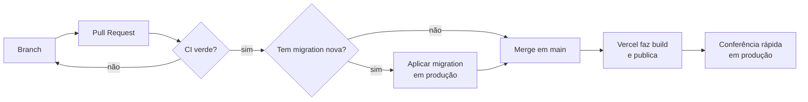

# Operação

Como o sistema roda em produção e o que fazer no dia a dia e quando algo dá errado. Para a
**primeira** configuração (criar projetos, ligar o Google), veja
[CONFIGURAR-PRODUCAO.md](CONFIGURAR-PRODUCAO.md).

## 1. Ambientes

| Ambiente      | Frontend                                   | Banco                          | Para quê                                  |
| ------------- | ------------------------------------------ | ------------------------------ | ----------------------------------------- |
| **Local**     | `npm run dev` em `localhost:3000`          | Supabase local (Docker)        | Desenvolvimento e testes                  |
| **CI**        | Build no GitHub Actions                    | Supabase local efêmero         | Validar cada PR                           |
| **Preview**   | URL temporária da Vercel por PR/branch     | **Produção** (mesmas variáveis) | Ver a mudança antes do merge             |
| **Produção**  | https://onde-tem-feira.vercel.app          | Projeto Supabase (São Paulo)   | Usuários reais                            |

> **Atenção:** os previews da Vercel usam o **banco de produção**. Um preview com código novo
> que depende de uma migration ainda não aplicada vai mostrar erros, e ações feitas num
> preview (relatos, sugestões) são reais. Se o projeto crescer, crie um projeto Supabase de
> _staging_ e configure as variáveis só para "Preview".

## 2. Do commit à produção



- **Deploy é automático:** todo push em `main` gera um deploy de produção na Vercel.
- **Ordem com banco:** migration **antes** do merge. As migrations do projeto são aditivas
  (código antigo continua funcionando com o banco novo); assim não há janela de erro.
- **Variáveis de ambiente** mudaram? Na Vercel, as `NEXT_PUBLIC_*` entram no build: depois de
  alterar, faça **Redeploy**.

## 3. Rollback

| Problema                     | Ação                                                                                              |
| ---------------------------- | ------------------------------------------------------------------------------------------------- |
| Deploy quebrou o site        | Vercel → Deployments → deploy anterior → **⋯ → Promote to Production** (segundos). Depois, reverta o commit com `git revert` em um PR. |
| Migration com problema       | Não existe "desfazer" automático. Escreva uma migration nova que corrija (ex.: recriar a política anterior). Por isso as migrations devem ser aditivas. |
| Dados apagados por engano    | Restaurar do último backup (seção 7).                                                             |

## 4. Migrations em produção

Há duas formas. Escolha uma e mantenha.

### Opção A — Supabase CLI (recomendada)

```bash
npx supabase login
npx supabase link --project-ref <REFERENCE_ID>
npx supabase db push        # aplica só as migrations que ainda não rodaram
```

O CLI registra o que já foi aplicado em `supabase_migrations.schema_migrations`.

### Opção B — SQL Editor

Abra o arquivo da migration nova, cole no **SQL Editor** do Supabase e clique em **Run**.
Foi assim que a produção foi configurada até a versão 1.1.0.

> **Ao migrar da opção B para a A:** o CLI não sabe que as migrations antigas já rodaram e
> tentaria executá-las de novo (e falharia). Antes do primeiro `db push`, marque-as como
> aplicadas:
>
> ```bash
> npx supabase migration repair --status applied 20261004120000 20261004120100 20261005120000 20261006120000
> ```

### Depois de qualquer migration

- Confira no **Table Editor** se as tabelas/colunas existem.
- Rode no SQL Editor `select * from public.feiras limit 1;` para ver se nada quebrou.
- Faça o merge do PR que depende dela.

## 5. Rotinas

| Frequência      | Tarefa                                                                                                   | Onde                                    |
| --------------- | -------------------------------------------------------------------------------------------------------- | --------------------------------------- |
| Semanal         | Revisar sugestões e denúncias                                                                            | `/admin`                                |
| Semanal         | Revisar e fazer merge do PR do Dependabot (CI verde)                                                     | GitHub                                  |
| Mensal          | Backup do banco (seção 7)                                                                                | Terminal                                |
| Mensal          | Olhar uso dos planos gratuitos (banco, Storage, banda, e-mails)                                          | Painéis do Supabase e da Vercel         |
| Semestral       | Reconferir dados das fontes oficiais e atualizar o catálogo                                              | [DADOS.md](DADOS.md)                    |
| Quando necessário | Promover/remover administrador                                                                         | SQL Editor ([BANCO-DE-DADOS.md § 7](BANCO-DE-DADOS.md#7-consultas-úteis-sql-editor)) |

### Moderação

- **Sugestões:** aprove só o que for plausível (o ponto no mapa bate com o endereço? a feira
  existe em alguma fonte?). Feiras aprovadas entram como "não verificadas".
- **Denúncias:** "Ocultar relato" tira o relato do mural (continua no banco). "Manter e descartar
  denúncias" encerra o caso.
- **Usuário abusivo:** Supabase → Authentication → Users → **⋯ → Ban user**. Se preciso, apague
  os relatos dele pelo SQL Editor.
- **Pedido de exclusão por e-mail (LGPD):** Supabase → Authentication → Users → localizar pelo
  e-mail → **Delete user** (apaga tudo em cascata; as fotos ficam em
  Storage → `post-photos/<id>` e devem ser apagadas à mão). Responda em até 15 dias.

## 6. Monitoramento

O projeto não tem ferramenta de monitoramento paga. O que olhar:

| O quê                         | Onde                                                                 |
| ----------------------------- | -------------------------------------------------------------------- |
| Site fora do ar / erro 500    | Vercel → Deployments → **Logs** (Runtime Logs)                       |
| Falha ao ler o catálogo       | Logs da Vercel com `[feiras] falha ao ler do Supabase` (o site continua no ar com o JSON local) |
| Erros de login                | Supabase → **Logs → Auth**                                           |
| Erros de banco / RLS          | Supabase → **Logs → Postgres** e **API**                             |
| Limites do plano gratuito     | Supabase → **Usage**; Vercel → **Usage**                             |
| Vulnerabilidades              | GitHub → **Security** (Dependabot alerts)                            |

Sugestão de baixo custo: um monitor gratuito de disponibilidade (ex.: UptimeRobot) apontando
para a página inicial.

## 7. Backup e restauração

O plano gratuito do Supabase **não** oferece restauração de backup pelo painel.

```bash
# backup (precisa do link do passo 4A)
npx supabase db dump -f backup-esquema.sql
npx supabase db dump --data-only -f backup-dados-$(date +%F).sql
```

Guarde os arquivos fora do computador (ex.: Google Drive). Eles contêm dados pessoais
(e-mails em `auth.users` não entram no dump de `public`, mas nomes e relatos sim): trate como
confidenciais.

**Restaurar** num projeto novo: aplicar as migrations (`db push`) e depois
`psql "<connection string>" -f backup-dados-AAAA-MM-DD.sql`.

As fotos do Storage não entram no dump; para guardá-las, baixe a pasta `post-photos` pelo
painel.

## 8. Resposta a incidentes

| Situação                                    | Primeiro passo                                                                                     | Depois                                                     |
| ------------------------------------------- | -------------------------------------------------------------------------------------------------- | ---------------------------------------------------------- |
| Site fora do ar                             | Status da Vercel; promover o deploy anterior                                                       | Ver logs, corrigir em PR                                   |
| Mapa abre mas login/mural não               | Status do Supabase (status.supabase.com); projeto pausado por inatividade? (plano gratuito pausa após ~1 semana sem uso) → **Restore project** | Considerar um acesso periódico/monitor |
| "Entrar com Google" dá erro                 | Supabase → Auth → Providers → Google ativo? URLs em URL Configuration incluem o domínio?          | Conferir o cliente OAuth no Google Cloud                   |
| E-mails de login não chegam                 | Limite de envio do servidor padrão atingido                                                        | Configurar SMTP próprio (Resend)                           |
| Spam no mural                               | Ocultar relatos em `/admin`; banir o usuário                                                       | Reduzir o limite em `posts_rate_limit` numa migration      |
| Suspeita de vazamento ou falha de segurança | Seguir [SECURITY.md](../SECURITY.md); se uma chave secreta vazou, gere outra em Supabase → Settings → API | Registrar o que aconteceu e o que foi feito          |

## 9. Contas e acessos

| Serviço        | Quem administra | Observação                                                  |
| -------------- | --------------- | ----------------------------------------------------------- |
| GitHub         | Israel          | Repositório `israellins/onde-tem-feira`                     |
| Vercel         | Israel          | Projeto `onde-tem-feira`                                    |
| Supabase       | Israel          | Projeto em São Paulo; senha do banco guardada fora do repositório |
| Google Cloud   | Israel          | Cliente OAuth e tela de consentimento publicada             |

Ative a verificação em duas etapas em todos. Nenhuma senha ou chave secreta deve estar no
repositório, em issues ou em mensagens.
