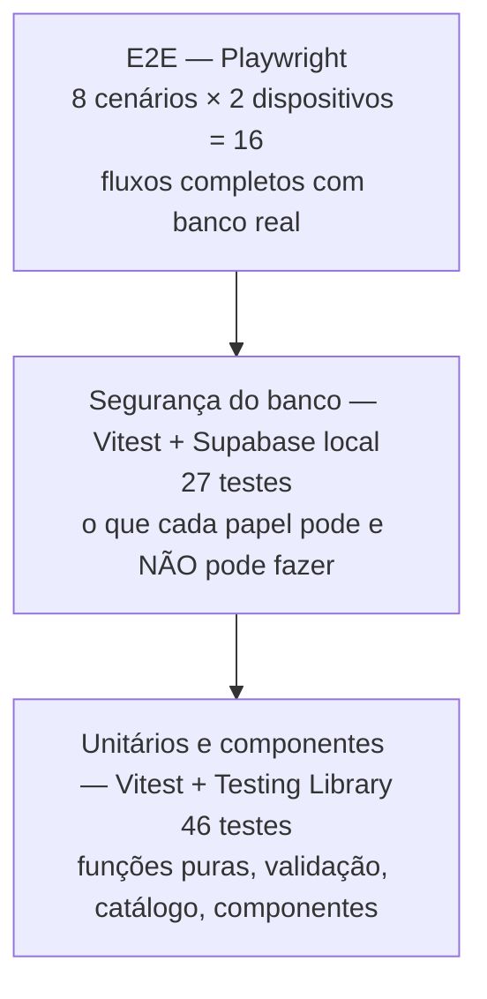

# Testes

## 1. Estratégia

Como não existe backend próprio, **a segurança inteira está no banco**. Por isso a estratégia
dá peso especial aos testes de RLS, que exercitam o banco real como um usuário mal-intencionado
faria.



| Suíte                | Pasta                | Ambiente                              | Comando             | Tempo aprox. |
| -------------------- | -------------------- | ------------------------------------- | ------------------- | ------------ |
| Unitários/componentes | `tests/unit/`       | jsdom, sem rede                       | `npm test`          | segundos     |
| Segurança do banco   | `tests/integration/` | Node + Supabase local (Docker)        | `npm run test:db`   | ~10 s        |
| Ponta a ponta        | `tests/e2e/`         | Chromium + app buildado + Supabase local + Mailpit | `npm run test:e2e` | ~2 min |

Todas rodam no CI a cada Pull Request (veja [FERRAMENTAS.md § 5](FERRAMENTAS.md#5-integração-contínua-github-actions)).

## 2. O que cada suíte cobre

### Unitários e componentes (`tests/unit/`)

| Arquivo                | Cobre                                                                                         |
| ---------------------- | --------------------------------------------------------------------------------------------- |
| `lib.test.ts`          | `filterFeiras` (cidade, dia, Hoje, busca sem acento e com várias palavras), dias da semana, formatação de moeda/data, `parseMoney`, `friendlyError` |
| `data.test.ts`         | **Qualidade do catálogo**: esquema, ids únicos, dias sem repetição, toda cidade com centro, feira a menos de 40 km do centro, não verificada nunca "oficial", nenhum horário sem fonte, espaços duplicados, ordenação |
| `community.test.ts`    | Esquemas Zod de relato e sugestões, lista de compras local (inclusive dados corrompidos), validação de foto |
| `components.test.tsx`  | `<Filters>`, `<FeiraCard>` (selos, "Como chegar" seguro), `<ShoppingListModal>` sem login      |

### Segurança do banco (`tests/integration/rls.test.ts`)

Cria usuários reais no Supabase local (alice, bob, moderador e, para o compartilhamento,
outros), faz login com cada um e tenta operações permitidas e **proibidas**. Cobre perfis,
catálogo, mural, denúncias, limites antiabuso, lista privada, confirmações, sugestões e
moderação, Storage, exclusão de conta e compartilhamento da lista. A tabela de
rastreabilidade em [REQUISITOS.md § 7](REQUISITOS.md#7-rastreabilidade-requisitos--testes)
mostra qual teste cobre cada requisito.

> Os testes são **pulados** se `SUPABASE_TEST_URL` não estiver definido e **nunca** devem
> apontar para produção: eles criam e apagam usuários.

### Ponta a ponta (`tests/e2e/`)

| Cenário                                                                            | Com login |
| ---------------------------------------------------------------------------------- | --------- |
| Carrega o mapa, lista e filtros                                                    | Não       |
| Abre detalhes de uma feira com selos e mural vazio                                 | Não       |
| Lista de compras funciona sem login                                                | Não       |
| Páginas institucionais                                                             | Não       |
| Login real por e-mail, relato, confirmação, lista sincronizada e logout            | Sim       |
| Sugerir nova feira e excluir a conta                                               | Sim       |
| Moderador aprova correção sugerida por usuário                                     | Sim (2 contas) |
| Dono compartilha por e-mail, convidado edita, dono vê quem adicionou               | Sim (2 contas) |

O login é **real**: o teste pede o link por e-mail, lê o e-mail no Mailpit
(`tests/e2e/helpers.ts → waitForMagicLink`) e abre o link. Cada cenário roda nos projetos
**desktop** (Desktop Chrome) e **celular** (Pixel 7), em `pt-BR` e fuso `America/Cuiaba`.

## 3. Como rodar

```bash
# unitários
npm test
npm run test:watch                     # modo observação

# banco
npm run db:start
npm run test:db

# E2E (o .env.local precisa apontar para o Supabase local)
npm run build
npm run test:e2e
npx playwright test --ui               # interface para depurar
npx playwright test -g "compartilha"   # um cenário só
npx playwright show-trace test-results/<pasta>/trace.zip   # rastro de uma falha
```

Cobertura das funções puras: instale `@vitest/coverage-v8` (não vem no projeto) e rode
`npx vitest run tests/unit --coverage`. O `vitest.config.mts` já limita o relatório a
`src/lib/**` e `src/types/**`.

## 4. Como escrever bons testes aqui

- **Teste o comportamento, não a implementação.** Em componentes, busque por papel e rótulo
  (`getByRole("button", { name: "Compartilhar" })`), como o usuário e o leitor de tela fazem.
- **Para cada regra de segurança, teste o "não pode".** Ex.: "bob não lê a lista de alice",
  "anônimo não chama `delete_my_account`". Um teste que só verifica o caminho feliz não protege
  nada.
- **Dados únicos por execução** (`Date.now()` no e-mail) para os testes não colidirem.
- **Sem dados inventados no catálogo de teste**: use feiras reais do JSON
  (ex.: `sp-vila-madalena-sab-01`).
- **Componentes com `<dialog>`**: o `tests/setup.ts` simula `showModal()`/`close()` que o
  jsdom não implementa.
- **Arquivos de integração** começam com `// @vitest-environment node` (o cliente Supabase
  precisa de `fetch` real, não do jsdom).
- Um bug corrigido ganha um teste que falharia sem a correção.

## 5. Teste manual antes de uma versão

Além do CI, vale um roteiro rápido em produção depois do deploy:

- [ ] Abrir o site no celular; filtros e "Hoje" funcionam
- [ ] Entrar com Google e com link por e-mail
- [ ] Publicar e apagar um relato com foto
- [ ] Confirmar uma feira e ver o selo
- [ ] Enviar uma sugestão e aprová-la em `/admin` (aparece no mapa em até 5 min)
- [ ] Compartilhar a lista com uma segunda conta e adicionar um item por ela
- [ ] Excluir uma conta descartável
